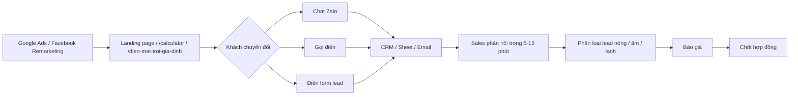

# EPCVINA Marketing Master Guide

**Website gốc:** `epcvina.com`
**Dự án:** `epcvinasolar`  
**Mục tiêu cuối cùng:** khách chat Zalo, gọi điện hoặc điền form lead để lấy thông tin tư vấn

Tài liệu này là bản dùng chung cho marketing, kỹ thuật, sales và quản lý.

---

## 1. Bối cảnh

- Website chính: `epcvina.com`
- Folder gốc dự án web: `epcvinasolar`
- Folder tài liệu marketing: `epcvinamarketing`
- Ngân sách quảng cáo: `30 triệu/tháng`
- Khu vực chạy ads: Hà Nội và các tỉnh lân cận
- Đối tượng: hộ gia đình, nhà dân, nhà phố, biệt thự
- Kênh chính: Google Ads Search
- Kênh phụ: Facebook Remarketing
- Kênh social chính: [Facebook EPCVINA](https://www.facebook.com/epcvinacom/)
- Quản lý vận hành marketing: Mr. Tráng
- Tư vấn điện thoại / Zalo: Mrs. Giang
- Cần thẻ Visa / Master để chạy quảng cáo và lấy hóa đơn hợp lệ cho công ty

---

## 2. Câu chuẩn dùng chung

`3 cách khách liên hệ cuối cùng` = chat Zalo, gọi điện hoặc điền form để lấy thông tin tư vấn.

Mọi tài liệu marketing trong thư mục này nên bám đúng câu chuẩn trên.

---

## 3. Lead flow

### Quy trình chuẩn

1. Khách vào từ Google Ads hoặc Facebook Remarketing.
2. Khách xem trang phù hợp: `/`, `/calculator`, `/dien-mat-troi-gia-dinh`.
3. Khách chat Zalo, gọi điện hoặc điền form lead.
4. Hệ thống ghi nhận event và đẩy lead về email, sheet hoặc CRM.
5. Sales phản hồi trong 5-15 phút.
6. Phân loại lead và đưa sang báo giá.
7. Đối soát theo campaign để biết nhóm nào ra lead chất lượng nhất.

---

## 4. Cấu trúc chiến dịch Google Ads

### Campaign 1: Brand Search

- Mục tiêu: bảo vệ thương hiệu EPCVINA.
- Landing page: `/`
- Keyword mẫu:
  - epcvina solar
  - epcvinasolar
  - epcvina điện mặt trời

### Campaign 2: Search - Điện mặt trời gia đình

- Mục tiêu: bắt nhu cầu mua rõ ràng.
- Landing page: `/dien-mat-troi-gia-dinh`
- Keyword mẫu:
  - lắp điện mặt trời gia đình
  - giá lắp điện mặt trời gia đình
  - lắp điện mặt trời nhà phố
  - lắp điện mặt trời nhà dân

### Campaign 3: Search - Chi phí và hoàn vốn

- Mục tiêu: bắt nhu cầu so sánh và cân nhắc.
- Landing page: `/calculator`
- Keyword mẫu:
  - điện mặt trời bao nhiêu tiền
  - tính chi phí lắp điện mặt trời
  - điện mặt trời hoàn vốn bao lâu
  - báo giá điện mặt trời gia đình

### Campaign 4: Remarketing Google

- Mục tiêu: bám đuổi người đã vào web nhưng chưa chuyển đổi.
- Landing page: `/calculator` và `/dien-mat-troi-gia-dinh`

---

## 5. Facebook Remarketing

Chỉ dùng sau Google để hỗ trợ nhắc lại và kéo lại tệp đã vào web.

### 7 ngày
- Tệp nóng nhất
- Nội dung: nhắc lại lợi ích, CTA mạnh

### 30 ngày
- Tệp đang cân nhắc
- Nội dung: so sánh chi phí, hoàn vốn, case thực tế

### 90 ngày
- Tệp rộng hơn
- Nội dung: thương hiệu, dự án, độ tin cậy

---

## 6. Phân tích đối thủ và keyword planner

### 6.1 5 đối thủ cần chú ý nhất

1. SolarMax (SLM Solar)
   - Website: `slmsolar.com`
   - Mạnh về marketing, minh bạch báo giá hệ hybrid.
2. Sunemit
   - Website: `sunemit.com`
   - Top đầu phủ từ khóa SEO dân dụng tại Hà Nội.
3. Techpal Solar
   - Website: `techpalsolar.com` và `solar.techpal.vn`
   - Có hậu thuẫn thương hiệu và giải pháp hybrid thông minh.
4. Điện Mặt Trời MAG
   - Website: `dienmattroimag.com`
   - Mạnh về thiết kế 3D và định vị công nghệ.
5. Givasolar / Việt Nam Solar / EC-Tech Việt Nam
   - Website:
     - `givasolar.com`
     - `vietnamsolar.vn`
     - `ec-tech.vn`
   - Mạnh ở hệ sinh thái bán lẻ, kỹ thuật và cấu hình thiết bị.

### 6.2 5 insight cạnh tranh

1. Đối thủ đang mạnh ở keyword rộng như `điện mặt trời`, `năng lượng mặt trời`, `lắp điện mặt trời`.
2. Nhóm keyword dân dụng và nhà phố tại Hà Nội vẫn là sân chơi chính.
3. Nhiều đối thủ tập trung thiết bị hoặc hybrid, nên EPCVINA có thể thắng bằng tư vấn thực tế và lead flow rõ.
4. Keyword `chi phí`, `báo giá`, `hoàn vốn` là nhóm có ý định cao nên cần ưu tiên.
5. Mục tiêu cuối cùng vẫn phải đưa về 3 cách khách liên hệ cuối cùng:
   - chat Zalo
   - gọi điện
   - điền form lead để lấy thông tin tư vấn

### 6.3 Keyword planner ưu tiên

#### Nhóm Brand
- epcvina solar
- epcvinasolar
- epcvina điện mặt trời
- epcvina solar hà nội

#### Nhóm Điện mặt trời gia đình
- lắp điện mặt trời gia đình
- giá lắp điện mặt trời gia đình
- điện mặt trời gia đình hà nội
- lắp điện mặt trời nhà dân
- lắp điện mặt trời nhà phố
- điện mặt trời mái nhà
- lắp điện mặt trời tại hà nội

#### Nhóm Chi phí và hoàn vốn
- điện mặt trời bao nhiêu tiền
- lắp điện mặt trời hết bao nhiêu tiền
- tính chi phí lắp điện mặt trời
- báo giá điện mặt trời gia đình
- điện mặt trời hoàn vốn bao lâu
- chi phí lắp điện mặt trời nhà dân

#### Nhóm ý định mua cao
- khảo sát lắp điện mặt trời
- tư vấn điện mặt trời gia đình
- báo giá lắp điện mặt trời
- giải pháp điện mặt trời cho nhà phố

### 6.4 Từ khóa nên chạy ngay

- lắp điện mặt trời gia đình
- giá lắp điện mặt trời gia đình
- điện mặt trời gia đình hà nội
- điện mặt trời bao nhiêu tiền
- báo giá điện mặt trời gia đình
- lắp điện mặt trời nhà dân
- lắp điện mặt trời nhà phố
- điện mặt trời hoàn vốn bao lâu

### 6.5 Từ khóa nên loại trừ sớm

- miễn phí
- pdf
- tuyển dụng
- việc làm
- tự làm
- đồ án
- học sinh
- ảnh
- video
- wiki

### 6.6 Chi tiết quảng cáo sẽ chạy

| Campaign | Mục tiêu | Landing page | Thông điệp chính | Ghi chú |
|---|---|---|---|---|
| Brand Search | Bảo vệ thương hiệu | `/` | EPCVINA Solar, tìm đúng thương hiệu, đúng đơn vị | Chạy ngân sách nhỏ, giữ vị trí thương hiệu |
| Search - Gia đình | Bắt nhu cầu mua thật | `/dien-mat-troi-gia-dinh` | Lắp điện mặt trời cho nhà dân, nhà phố, biệt thự | Campaign chính, ưu tiên ngân sách lớn nhất |
| Search - Chi phí | Bắt nhu cầu cân nhắc | `/calculator` | Tính chi phí đầu tư, thời gian hoàn vốn, báo giá nhanh | Dùng để lọc khách có ý định cao |
| Remarketing Google | Kéo lại khách đã vào web | `/calculator`, `/dien-mat-troi-gia-dinh` | Xem lại giải pháp, nhận tư vấn lại, nhận báo giá | Chỉ dùng cho tệp đã có hành vi |
| Facebook Remarketing 7 ngày | Nhắc lại tệp nóng | Bài remarketing theo nhu cầu | Bạn đã xem giải pháp, nhận tư vấn ngay | Tệp nóng nhất, ưu tiên CTA mạnh |
| Facebook Remarketing 30 ngày | Bám đuổi tệp cân nhắc | Bài so sánh, case thực tế | So sánh chi phí, hoàn vốn, phương án phù hợp | Nội dung tư vấn, không bán quá gắt |
| Facebook Remarketing 90 ngày | Giữ nhận diện | Bài thương hiệu, dự án | Xem lại EPCVINA Solar, nhận tư vấn khi cần | Dùng để duy trì độ nhớ thương hiệu |

### 6.7 KPI mục tiêu để nhận ngân sách

| Chỉ số | Mục tiêu tháng 1 | Mục tiêu theo dõi |
|---|---|---|
| Impression Google Search | 12,000 - 25,000 | Có đủ độ phủ để test thị trường Hà Nội |
| CTR Google Search | >= 5% | Đánh giá mức độ hấp dẫn của headline và keyword |
| CPC trung bình | 4,000đ - 12,000đ | Giữ trong ngưỡng hợp lý cho lead gia đình |
| Số lead đủ chuẩn / tháng | 60 - 120 | Lead vào đúng khu vực, đúng nhu cầu, đúng tệp |
| Tỷ lệ chuyển đổi form / click | 3% - 8% | Đo chất lượng landing page và CTA |
| Tỷ lệ chat Zalo / gọi điện | 20% - 40% | Đánh giá mức độ phản hồi và nhu cầu thực tế |
| Tỷ lệ phản hồi lead | <= 15 phút | Không để mất khách trong giờ đầu |
| Tỷ lệ lead đủ điều kiện | >= 60% | Dùng để quyết định scale ngân sách |
| Tỷ lệ remarketing click | >= 1.5% | Đo độ bám của Facebook remarketing |
| Số cuộc gọi / chat Zalo / form | 3 cách khách liên hệ cuối cùng | Mục tiêu cuối cùng để chốt tư vấn |

---

## 7. Tracking tối thiểu

- GA4 hoạt động trên toàn site.
- GTM nếu có phải chạy ổn định.
- Google Ads conversion phải map rõ.
- UTM phải đi qua form hoặc CRM.
- Event ưu tiên:
  - `lead_submit`
  - `hotline_click`
  - `landing_inline_lead_submitted`
  - `exit_popup_submit`
  - `exit_popup_hotline`

---

## 8. Checklist launch nhanh

### Trước khi bật ads

- Form hoạt động.
- Hotline bấm được.
- Zalo bấm được nếu còn hiển thị.
- Lead về đúng email / CRM / sheet.
- Sales sẵn sàng phản hồi trong 5-15 phút.
- Keyword phủ định đã chốt.

### Sau khi bật ads

- Theo dõi impression, click, conversion.
- Ghi nhận lead chất lượng / lead lỗi.
- Tắt nhóm không ra lead.
- Tăng ngân sách cho nhóm tốt.

---

## 9. Vai trò sales trong lead flow

### Khi lead mới về

1. Gọi lại trong 5-15 phút.
2. Nếu không bắt máy thì nhắn Zalo hoặc gọi lại lần 2.
3. Xác nhận nhu cầu:
   - nhà dân / nhà phố / biệt thự
   - khu vực
   - hóa đơn điện
   - diện tích mái
4. Nếu khách muốn xem chi phí thì chuyển sang báo giá.
5. Nếu khách cần tư vấn thêm thì tiếp tục chăm sóc.
6. Mr. Tráng theo dõi vận hành marketing, kiểm tra nguồn lead và ưu tiên tối ưu chiến dịch.
7. Mrs. Giang là người phụ trách tư vấn điện thoại / Zalo, đảm bảo phản hồi nhanh và đúng nhu cầu.

### Khi chốt lead

- Ghi trạng thái vào sheet hoặc CRM.
- Ghi nguồn campaign / landing page / UTM.
- Chuyển khách sang một trong 3 cách khách liên hệ cuối cùng:
  - chat Zalo
  - gọi điện
  - điền form lead để lấy thông tin tư vấn
- Nếu khách cần trao đổi tư vấn trực tiếp, ưu tiên chuyển cho Mrs. Giang.
- Mr. Tráng theo dõi chất lượng lead và feedback ngược cho team marketing nếu có lệch tệp.

### Khi lead không đạt

- Ghi lý do không chốt.
- Báo lại marketing nếu lead sai tệp hoặc sai khu vực.

---

## 10. Bảng công việc triển khai

| Người phụ trách | Công việc chính | Mục tiêu đầu ra |
|---|---|---|
| Mr. Tráng | Chốt cấu trúc campaign, kiểm tra tracking, theo dõi chất lượng lead, tối ưu ngân sách | Campaign chạy đúng, nguồn lead đọc được, quyết định scale / giữ / dừng rõ ràng |
| Mrs. Giang | Nhận và tư vấn khách qua điện thoại / Zalo, phản hồi nhanh, ghi trạng thái lead | Lead được phản hồi nhanh, có tư vấn rõ, tăng tỷ lệ chat Zalo / gọi điện / điền form |
| Mr. Tráng + Mrs. Giang | Đối soát lead theo ngày, báo lỗi nguồn hoặc lỗi tệp, cập nhật lại quy trình | Có số liệu sạch, biết nhóm nào ra lead tốt, chỉnh chiến dịch kịp thời |

## 11. Tài liệu liên quan

- [Kế hoạch quảng cáo tổng thể](./ke-hoach-quang-cao-epcvina-solar.md)
- [Phân tích đối thủ 5 insight](./phan-tich-doi-thu-5-insight.md)
- [Phân tích đối thủ + keyword planner](./phan-tich-doi-thu-5-insight-va-keyword-planner.md)
- [So sánh giá SLM Solar vs EPCVINA](./slm-vs-epcvina-so-sanh-gia.md)
- [Ad copies Google + Facebook](./ad-copies-google-facebook.md)
- [Checklist tracking 1 trang](./checklist-tracking-1-trang.md)
- [Checklist tracking chi tiết](./checklist-tracking-truoc-khi-chay-ads.md)
- [Launch order](./launch-order.md)
- [Mapping event Google Ads / Facebook](./event-mapping-google-facebook.md)
- [Checklist launch hôm nay](./launch-today-checklist.md)
